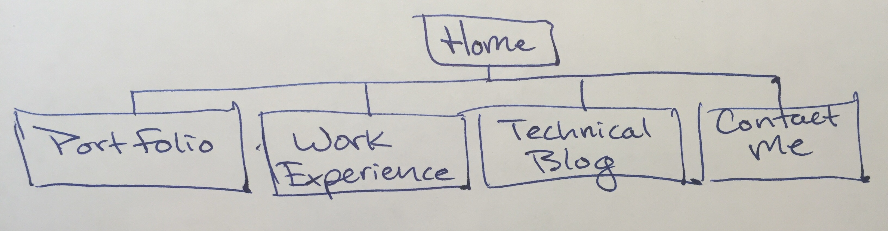

**What are the 6 Phases of Web Design?**
1. Information Gathering
2. Planning
3. Design
4. Development
5. Testing and Delivery
6. Maintenance

**What is your site's primary goal or purpose? What kind of content will your site feature?**
My site's primary goal is to distribute information about me. I will provide content that details my work experience, provides examples of my work, and narrates my skills and interests.

**What is your target audience's interests and how do you see your site addressing them?**
My target audience is prospective employers. I would like to format my site in a way that is easy for employers to quickly find relevant work information. I do not plan on employers to spend much time on my site, therefore I want to draw attention to the most important content first. I would like to headline interesting projects I've worked on. If they are interested in more information, I will provide additional content outside of the home page.

**What is the primary "action" the user should take when coming to your site? Do you want them to search for information, contact you, or see your portfolio? It's ok to have several actions at once, or different actions for different kinds of visitors.**
The primary action will be to see my portfolio of work. If a project headline interests an employer, than I will provide a link or another page for the employer to interact with or read more about that project and my contribution.

**What are the main things someone should know about design and user experience?**
Design and UX are not always a dedicated or even a recognized responsibility at every company. UX is given more attention when it directly affects the primary goal of the site and when they have the exhaustable resources. UX impact is difficult to measure, but can profoundly impact the usability and aesthetics of a site.

**What is user experience design and why is it valuable?**
Design and UX seek to improve the user's interaction with the company online. It is not only the format and layout of a site's content, but also the overall look and feel that the designer anticipates a user will experience. If a user is unable to figure out how to navigate the site in order to make a purchase, the site will undoubtedly lose many potential sales. Improving the overall design of the site and it's UX will encourage users to make purchases with ease. 

**Which parts of the challenge did you find tedious?**
Fairly smooth challenge. I enjoyed reading about UX design. Most tedious aspect was taking a picture of my paper layout for my site and uploading it onto my computer.
