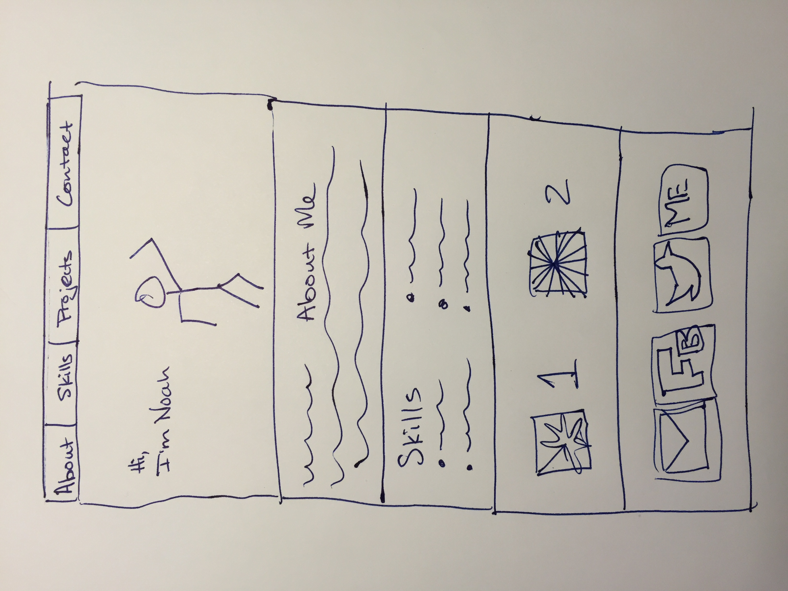
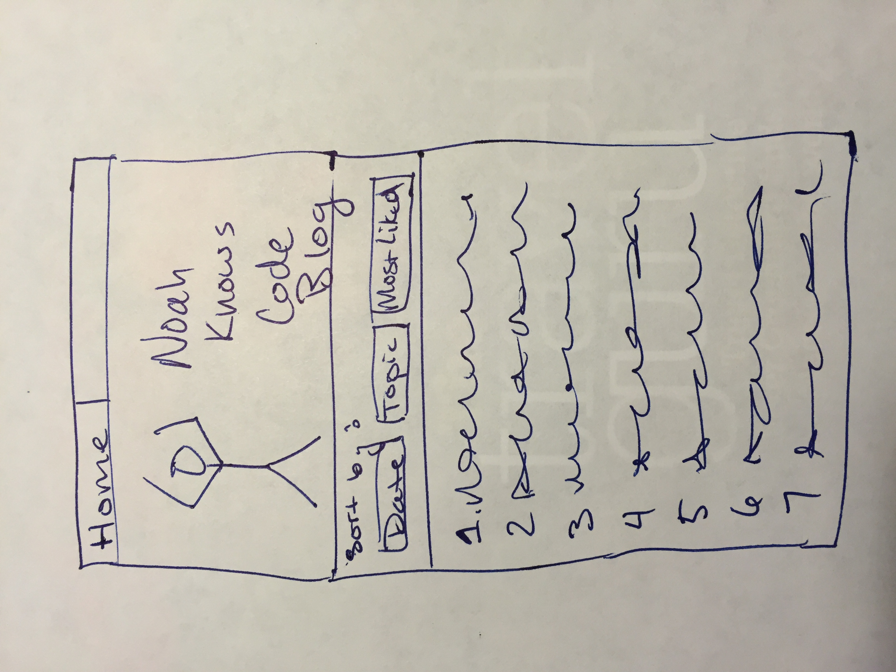

**What is a wireframe?**
A wireframe is a visual guide that developers use to draft what a website will look like before they start writing any code.  

**What are the benefits of wireframing?**
Much less time is spent drafting a wireframe rather than coding and presenting a complete product. Many people can provide quick input and offer suggested solutions to a web layout. Problems can also be found in the layout of a site before the time is committed to coding the site.

**Did you enjoy wireframing your site?**
I really enjoy wireframing. I have created wireframes and mockups for my own web-based and mobile software products. I believe is an extremely powerful practice to be able to quickly and easily showcase an idea to people.

**Did you revise your wireframe or stick with your first idea?**
Even though I felt like I thought out all the details before drawing, I still ended up drawing my wireframe about three times, because I found minute ways to improve the layout.

**What questions did you ask during this challenge? What resources did you find to help you answer them?**
"What is the difference between a wireframe and a mockup?" 
By asking google, I was able to find a graphic design forum that discussed the difference. A wireframe is exactly what we've discussed. It is often a pen and paper drawing of a layout. On the other hand, a mockup is often a detailed or even a pixel-perfect image of what the final image will look like.

**Which parts of the challenge did you enjoy and which parts did you find tedious?**
I enjoyed thinking of new web sites to design and even started drawing some of them. I find the assignment submission process to be slightly tedious, but admit that it's very important to become comfortable with the version control workflow process with git.
